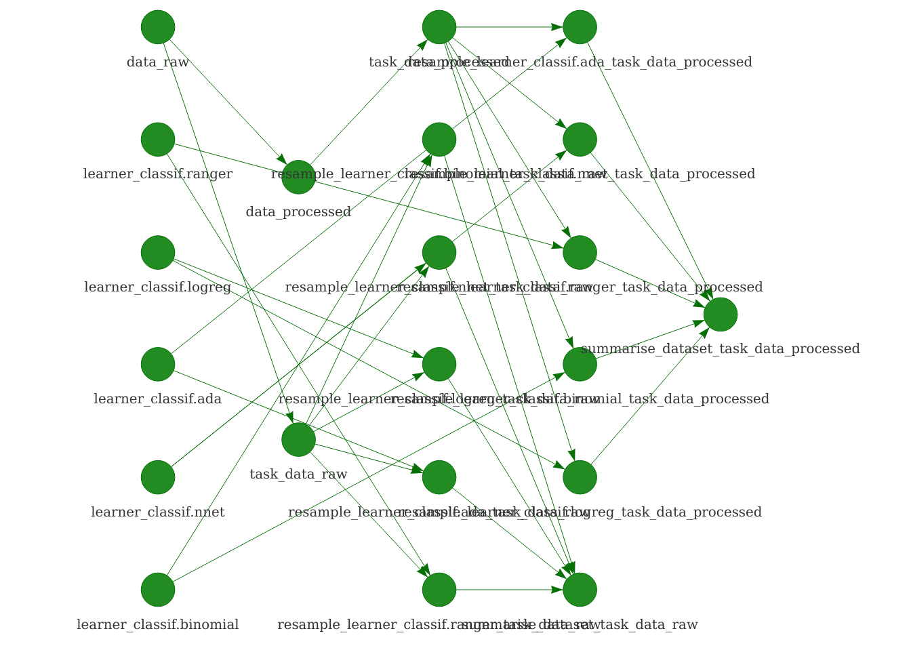

## drake package

\begin{figure}
  \includegraphics[width=0.4\textwidth]{logo.pdf}
\end{figure}

[ropensci/drake](https://github.com/ropensci/drake)

[Will Landau](https://github.com/wlandau-lilly)


## drake plan
```{r eval = FALSE, background="white"}
plan <- drake_plan(
  raw_data      = read.csv(file_in("appartments.csv")),
  prepared_data = prepare(raw_data),
  plot1         = make_plot1(prepared_data),
  regression    = lm(m2.price ~ ., prepared_data),
  plot2         = make_plot2(prepared_data, regression),
  report        = render(
    knitr_in("report.Rmd"),
    output_file = file_out("report.html")
  )
)
make(plan)
readd(plot1)
```

## visualizing plan

```{r eval = FALSE}
vis_drake_graph(drake_config(plan))
```


## visualizing plan

```{r eval = FALSE}
vis_drake_graph(drake_config(plan))
```


## visualizing plan

```{r eval = FALSE}
vis_drake_graph(drake_config(plan))
```


## parallelization

\tiny
```{r eval = FALSE, size="small"}
plan <- drake_plan(
  data_raw = read.csv(file_in("phplE7q6h.csv")),
  data_processed = normalizeFeatures(data_raw, target = "class"),
  task = target(
    makeClassifTask("task", data, "class"),
    transform = map(data = c(data_raw, data_processed))
  ),
  learner = target(
    makeLearner(model),
    transform = map(model = c("classif.ranger", 
                              "classif.logreg", 
                              "classif.ada",
                              "classif.nnet",
                              "classif.binomial"))
  ),
  resample = target(
    resample(learner, task, cv10),
    transform = cross(learner, task)
  ),
  summarise_dataset = target(
    summary(resample),
    transform = combine(resample, .by = task)
  )
)
```


## parallelization


## parallelization

```{r echo = FALSE, fig.width=10, fig.height=6, fig.align='center', message=FALSE}
library(ggplot2)
ggplot(data = read.csv2("benchmark.csv"), 
       aes(x = forcats::fct_reorder(test, c(1,4,2,3)), 
           y = elapsed)) +
  geom_bar(stat = "identity") +
  xlab("parallelization type") +
  ylab("elapsed execution time")

```

## summary

> - reproducibility
> - code management
> - parallelization

## the end

Thanks for your attention!

**Acknowledgements:**

Michał Burdukiewicz (Warsaw University of Technology)